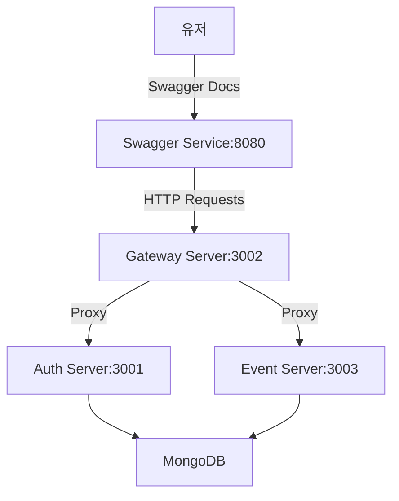
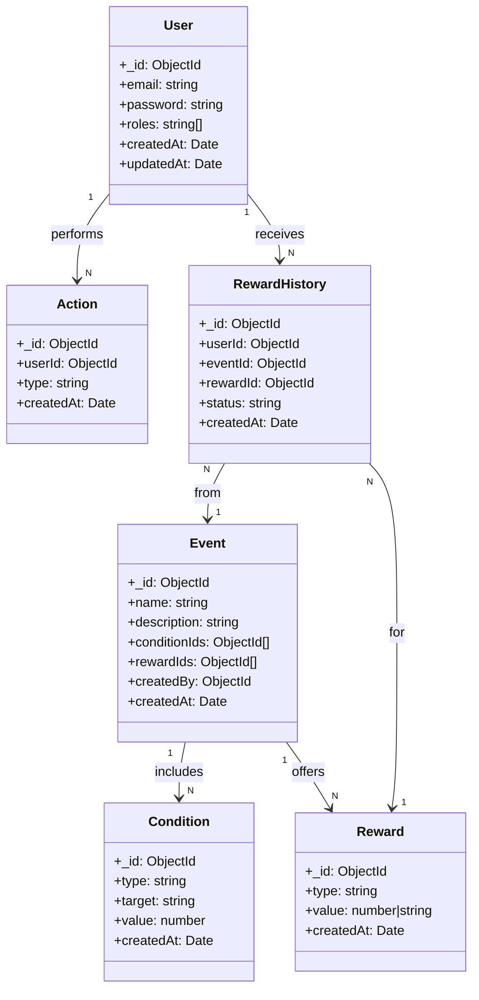

### 0. 프로젝트 구동 방법 및 테스트

1. 루트 디렉터리에서 `docker-compose up -d` 실행 → MongoDB, auth, gateway, event, swagger 서비스 시작
2. API 테스트 방법:

   * `http://localhost:8080/api-docs` → **Swagger UI**
   * `/http/gateway.http` → **REST Client**로 호출 (토큰 필요)
   * `npx ts-node test/e2e-runner.ts` → **시나리오 기반 E2E 테스트**
   * `yarn test` → **핵심 로직에 대한 테스트 실행**
        * `apps/event/test/rewards-condition-checker.spec.ts` → **조건 검증 로직 테스트**

---

### 1. 구현과정 중 발생한 문제와 해결 방법

#### 1.1 게이트웨이 서버에 매번 API를 복제해야 하는 번거로움

* 기존 방식: Auth/Event 서버에서 API 추가 시 **Gateway에도 동일한 컨트롤러 작성 필요**
* 문제점:

  * 작업 중복
  * 라우트 누락 위험
  * 유지보수 비용 증가

#### 해결

* **`routes.ts`에 경로 및 권한 정보 통합**
* \*\*`ProxyMiddleware`\*\*로 경로 프록싱
* 라우트 정보 기반으로 동적 분기 및 권한 검사 자동화
* 현재 게이트웨이 서버의 controller 로직은 swagger 생성 목적을 위함

---

#### 1.2 이벤트 조건 방식 다양 → 유연한 검증 구조 필요

* 조건 종류: `once`, `cumulative`, 향후 `time-based`, `quest` 등
* 문제점:

  * 서비스 복잡도 증가
  * 조건이 늘어날수록 코드 분기 부담

#### 해결

* `Condition` 스키마 일반화 (`type`, `actionType`, `targetCount`, `period`, `context`)
* `RewardsConditionCheckerService`에서 `type`에 따라 동적 분기 처리
* 조건 로직을 모듈화하여 조건 타입 추가 시 영향 최소화

---

### 2. 설계 구조

#### 2.1 서버 구조



---

#### 2.2 MongoDB 모델 설계



#### 2.3 관리자 조건 설정 흐름

* 이벤트 및 조건은 `/events` API에서 함께 등록
* 보상은 `/rewards` API로 등록
* 조건의 구조:

  * `type`, `actionType`, `targetCount`, `period`, `context`, `status`

```json
POST /api/v1/events
{
  "name": "Daily Login Event",
  "description": "Login 3 days in a row",
  "startDate": "...",
  "endDate": "...",
  "status": "active",
  "conditions": [
    {
      "actionType": "LOGIN",
      "conditionType": "cumulative",
      "targetCount": 3,
      ...
    }
  ]
}
```

---

### 3. 구현하는 과정에서 어떤 어려움이 있었는지

#### 3.1 동적 라우팅 설계

* **문제**: API가 늘어날수록 Gateway에 중복 작성 필요
* **해결**:

  * `routes.ts`에 경로/권한 정의 → 프록시 대상 추상화
  * `ProxyMiddleware`로 서비스 분기
  * `PATH_PATTERNS` + `PATH_ROLE_MAP`으로 경로 충돌 방지 및 권한 제어

#### 3.2 조건 검증의 유연성

* **문제**: 조건 타입 다양화에 따른 서비스 복잡도 증가
* **해결**:

  * `Condition` 구조를 범용 필드로 통합
  * 검증 로직을 `RewardsConditionCheckerService`에서 `type` 기준 분기
  * 새로운 조건 추가 시 서비스 로직만 수정하면 되도록 설계
 
### 4. 회고
이번 프로젝트를 진행하면서 이벤트 달성 조건이 이벤트 모델 내부에 함께 포함된 구조로 인해 테스트가 상당히 번거로웠습니다.

이벤트 달성 조건(condition)을 독립된 컬렉션으로 분리하지 않고 이벤트 내부에 정의하다 보니,
→ Swagger나 REST Client를 통한 단위 조건 테스트가 어려웠고,
→ 실제 동작 여부를 확인하려면 전체 이벤트 흐름을 따라가야만 했습니다.

이로 인해 다음과 같은 방식으로 테스트를 진행하게 되었습니다:

E2E 시나리오 테스트 (test/e2e-runner.ts)

조건 검증 유닛 테스트 (apps/event/test/rewards-condition-checker.spec.ts)

이 과정에서 테스트 코드 자체가 구조적으로 복잡해졌고,
복잡한 설계를 테스트 코드로 커버할 수 밖에 없었습니다.

다시 설계할 시간적 여유가 생긴다면, 조건 로직을 분리하거나 테스트 친화적인 구조로 바로잡을 것입니다.

고맙습니다.

### 5. 참고 자료


게이트웨이 서버의 routes.ts에서 request url별로 라우팅할 서버를 prefix로 관리하였고, api별로 호출 가능한 권한을 관리하여 접근 권한 관리를 하였습니다.
